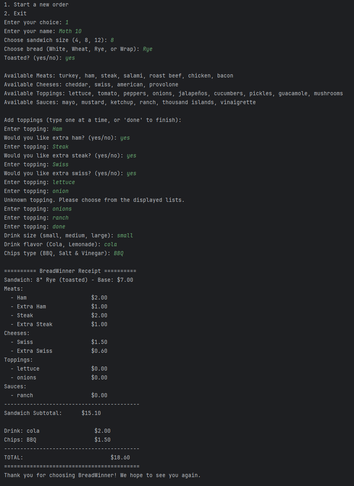

# BreadWinner

**BreadWinner** is a sandwich shop experience. Users can customize their sandwich, select drink and chip options, and receive a detailed receipt that is printed to the terminal and saved to a file.

---

## Project Summary

This application demonstrates core concepts in Java such as inheritance, composition, abstraction, and interface-driven design. It also integrates file output, receipt formatting, and class structure.

---

## Features

- Choose sandwich size, bread type, and whether the sandwich is toasted
- Add multiple toppings, categorized into:
  - Meats (Turkey, Ham)
  - Cheeses (Swiss, Cheddar)
  - Regular toppings (e.g., Lettuce, Tomato)
  - Sauces (Mayo, Ranch)
- Add a drink with size and flavor
- Add a chips option
- Automatically calculate total price
- Display order summary in the terminal
- Save receipt to a uniquely named `.txt` file using the customer name and timestamp

---

## How to Use

1. Open the project in IntelliJ IDEA
2. Run `Main.java`
3. Follow prompts in the terminal to build your sandwich
4. View the printed receipt and check the project folder for a saved receipt file

---

## Class Structure

The application follows a clean, modular structure with appropriate use of abstraction and composition. Here's a visual overview:


---

## Technologies Used

- Java 17
- IntelliJ IDEA
- GitBash & GitHub
- draw.io (for diagramming)

---

## Resources
- Raymond cheat sheets
- w3schools
- Stack overflow

---

## Code Highlight

```java
public abstract class Topping {
    protected String toppingName;

    public Topping(String toppingName) {
        this.toppingName = toppingName;
    }

    public abstract double getPrice(String sandwichSize);
}

```
---

## Sample Screenshot


**This is a screenshot**
---

## Authors

**Timothy Gomez**  
Student Developer

**Raymond Maroun**  
Instructor and Project Advisor

---

## Special Thanks

**Raymond Maroun** For Always going the extra mile to help and show he cares!
- **Pluralsight Java Curriculum (Provided by Raymond)** – for laying the foundation of object-oriented programming
- **Classmates & Reviewers** – for feedback, collaboration, and support

